# Dry Run — Architecture

> Decide from **observed effects** before an agent's command touches real files.
> Status: sub-project 1 (core) implemented as v0.1 on 2026-09-23. All 16 isolation canaries pass on WSL2
> 6.18 (`dryrun doctor`). Sub-projects 2 (benchmark) and 3 (judge model) are next.
> Companion documents: [design spec](superpowers/specs/2026-09-22-dry-run-core-design.md) ·
> [harm policy](harm-policy.md) · [research notes (facts)](research-notes.md) ·
> [research program](../research/program.md) · [experiment cards](../research/cards/).

---

## 1. What Dry Run is, in one picture

Current guards judge the command **text** (regexes, bashlex rule banks such as CARE) or ask a frontier
model for an opinion about the text (Claude Code auto mode). Bash rewrites text before it runs, so
indirection — `bash script.sh`, `python -c 'shutil.rmtree(p)'`, `find -delete`, `V=-rf; rm $V p`,
`base64 -d | sh` — defeats string-level inspection (GuardFall, anthropics/claude-code#85274,
ShellSieve).

Dry Run runs the command first in a **copy-on-write shadow of the workspace with no network**, records
what it **actually did**, judges that effect against **what the user asked for**, and on allow
**commits exactly the reviewed diff** instead of re-running the command.

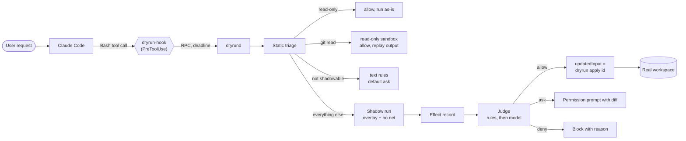

The novelty claim (see [research notes §1](research-notes.md) for positioning against YoloFS, Cordon,
pi-overlayfs and CARE): the combination of **(a)** execution in a shadow before commit, **(b)** a judge
over the *observed effect*, **(c)** consent scope from the user's request, and **(d)** committing the
reviewed diff rather than re-executing. No surveyed system combines all four.

---

## 2. Program structure: three sub-projects, shared contracts

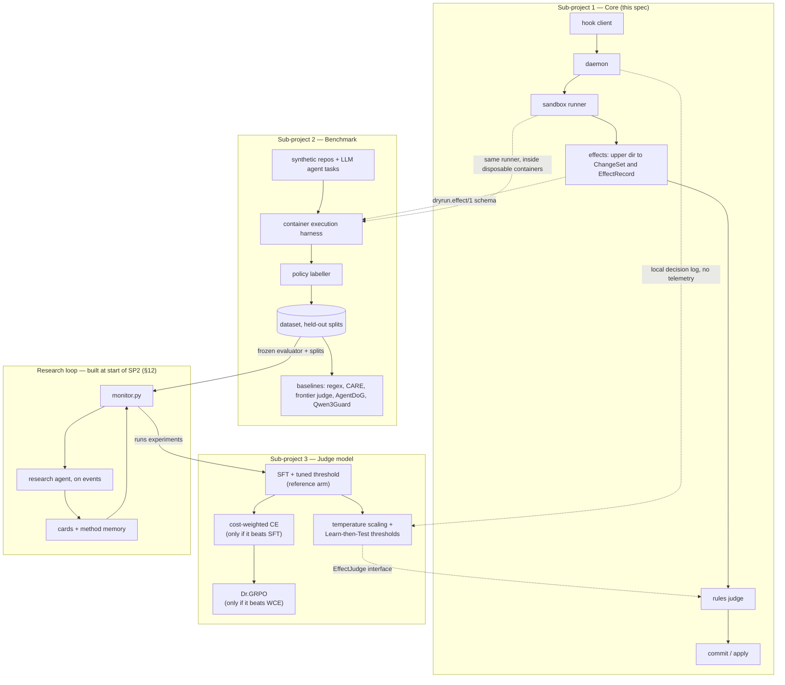

The **contracts** — `dryrun.effect/1`, `dryrun.changeset/1`, `dryrun.rpc/1` (JSON Schemas in
`schemas/`), and the `EffectJudge` interface — are fixed in sub-project 1. The benchmark measures
effects with the *same* sandbox runner and effect extractor, so what the model trains on is exactly
what it sees in deployment.

---

## 3. Components (sub-project 1)

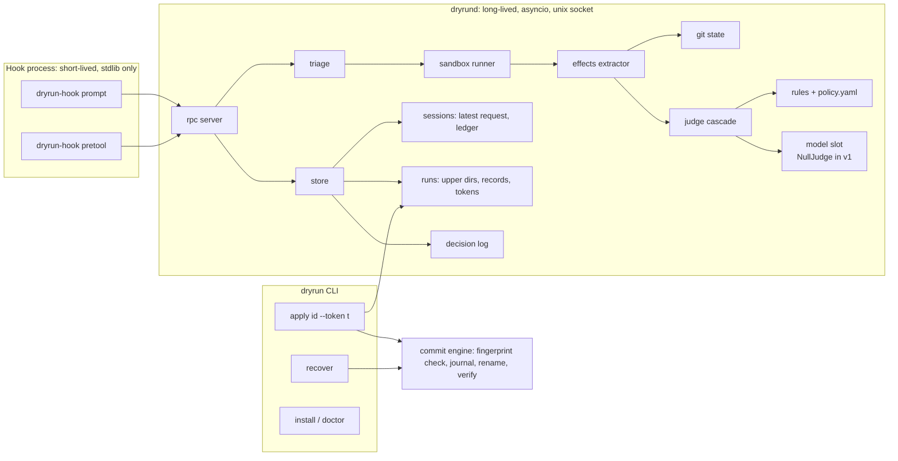

| Unit | One job | Depends on | Consumers |
|---|---|---|---|
| `hook` | Translate Claude Code hook JSON ⇄ RPC; **any fault → `ask`** | stdlib only | Claude Code |
| `rpc` | NDJSON over `$XDG_RUNTIME_DIR/dryrun.sock`, per-request deadline | asyncio | hook |
| `triage` | Parse with tree-sitter-bash; classify `read_only` / `git_read` / `apply` / `non_shadowable` / `long_running` / `shadow` | tree-sitter-bash | daemon |
| `sandbox` | Build and run the bwrap invocation; collect raw artifacts | vendored bwrap ≥ 0.11.1, strace | effects |
| `fingerprint` | Stat-walk `(ino,size,mtime_ns,ctime_ns,mode)`; racy-mtime hashing | os | sandbox, commit |
| `effects` | Upper dir → `ChangeSet` (noise-filtered) + `EffectRecord` | fingerprint, gitstate | judge, commit |
| `gitstate` | Per-path recoverability (`tracked_clean`/`tracked_dirty`/`untracked`/`ignored`), ref snapshot | git CLI | effects |
| `judge` | Cascade: hard rules → soft rules → model slot; one templated reason | policy.yaml | daemon |
| `commit` | Verify base fingerprints, journal, apply via `rename(2)`, fsync, verify, replay output | fingerprint | `dryrun apply`, `recover` |
| `store` | Sessions, session ledger, run dirs, single-use tokens, TTL cleanup, local decision log | fs | all |

---

## 4. The decision cascade

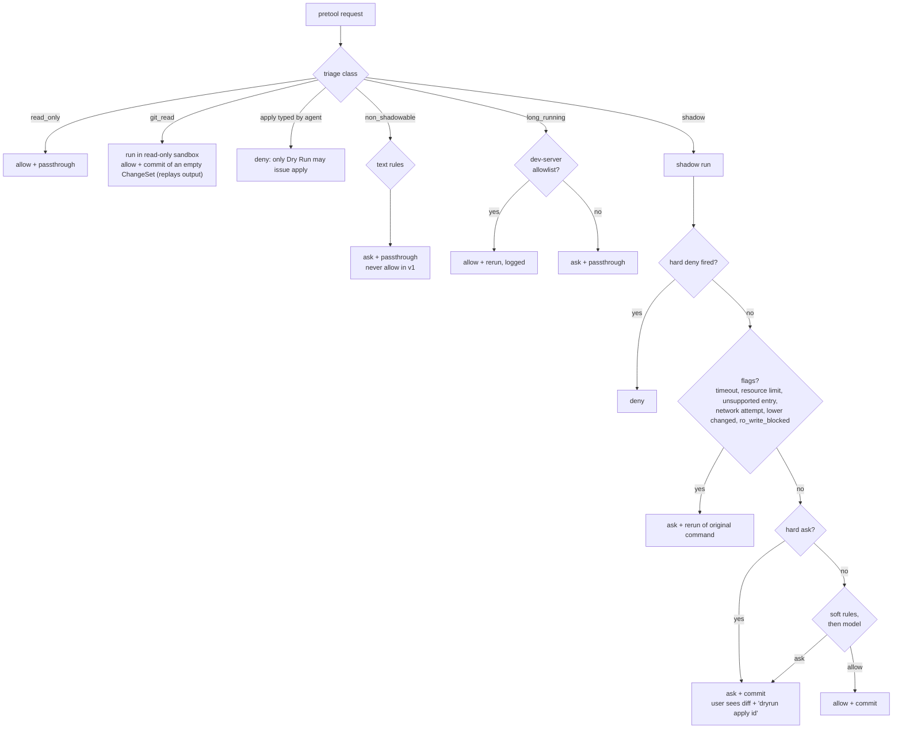

When the user approves an `ask + commit`, what gets applied is the **reviewed ChangeSet**, not a fresh
run of the command. `rerun` is used only when the ChangeSet can't represent the effect: home changes,
flags such as incomplete network or unsupported entries, and long-running processes.

Invariants:

1. **Fail to ask.** Every error, timeout, parse failure, missing daemon or unexpected upper-dir entry
   ends in `ask`. Claude Code lets a failed or timed-out hook *through*, so the hook client enforces this
   itself.
2. **The model can only move soft decisions.** A hard-rule verdict is final. In sub-project 3 the model
   can raise any decision and can lower a *soft* `ask` to `allow` only above its calibrated threshold.
3. **Commit what was reviewed.** `commit` mode never re-executes the command. `rerun` is reserved for
   cases the shadow cannot capture faithfully, and is always logged.

---

## 5. Happy path: allow and commit

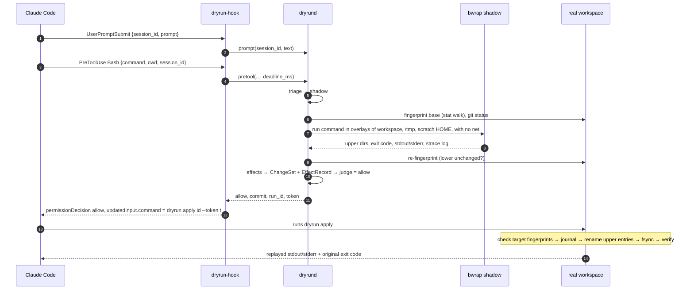

## 6. Failure path: daemon down or slow

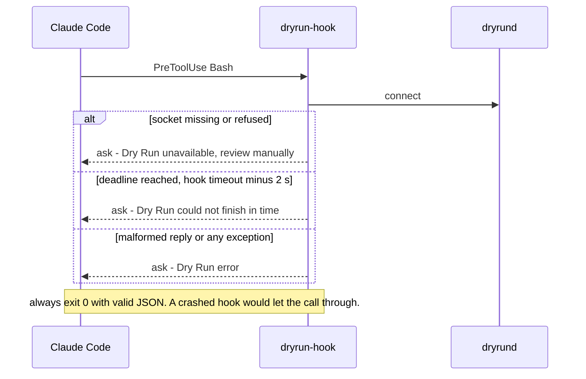

---

## 7. Shadow sandbox layout

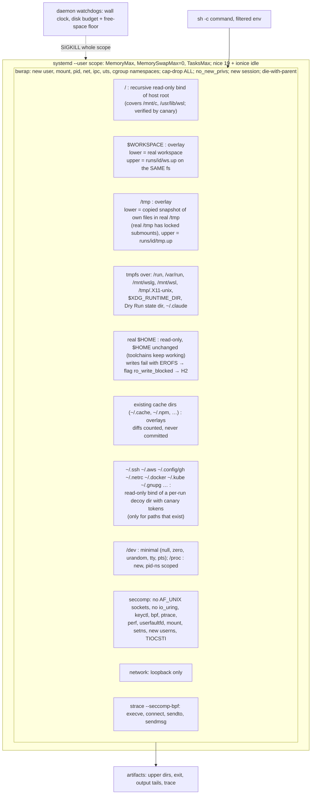

### 7.1 Isolation: the shadow must not affect the real system (CRITICAL)

**Threat model.** Treat the shadowed command as hostile. It may be an obfuscated `rm -rf ~`, a fork
bomb, a disk filler, or a script that tries to reach host services. The one thing the shadow may
change is its own upper directories. Real change happens only later, through a reviewed commit that is
confined to the workspace (and `/tmp`).

Every channel a process can use to affect the host has a mechanism that closes it, and a **canary** test
that proves it is closed:

| # | Channel to the real system | Mechanism | Canary (must fail inside the shadow) |
|---|---|---|---|
| I1 | Filesystem writes | Recursive read-only bind of `/`. Writable only: overlay uppers for the workspace, `/tmp` and existing home cache dirs, plus tmpfs mounts | write to `/`, real `$HOME`, `/mnt/c`, `/usr/lib/wsl`, and the real `/tmp` path behind the overlay |
| I2 | Unix-socket services (docker, D-Bus, systemd, snapd, udev, journal, X11/WSLg, ssh-agent, **dryrund itself**) | tmpfs over `/run`, `/var/run`, `$XDG_RUNTIME_DIR`, `/mnt/wslg`, `/tmp/.X11-unix`; **seccomp socket-family allowlist refuses AF_UNIX** (`socketpair` stays allowed) | connect to a canary socket the daemon listens on in the real `/tmp` |
| I3 | Network | Empty network namespace. Abstract unix sockets are per network namespace, so they are isolated too | TCP to 1.1.1.1:443, a DNS lookup, an abstract-socket connect |
| I4 | Host processes (signals, ptrace, `/proc`) | PID namespace; new `/proc`; seccomp denies ptrace and `process_vm_writev` | `kill` a canary host process by its PID |
| I5 | IPC (SysV/POSIX shm, message queues) | IPC namespace; private `/dev/shm` | attach to a canary shm segment |
| I6 | Devices | Minimal `/dev`, no block devices; `--new-session` and a seccomp rule block `TIOCSTI` terminal injection | open `/dev/sda`, run `TIOCSTI` |
| I7 | Kernel-wide state (keyrings, io_uring, bpf, perf, modules, mounts, time) | `cap-drop ALL`, `no_new_privs`, seccomp denylist (Docker default profile plus `io_uring_*`, since io_uring can create sockets without passing the `socket()` filter) | `keyctl`, `io_uring_setup`, `bpf` |
| I8 | Memory, which could OOM-kill the user's processes | cgroup `MemoryMax` (default 2 GiB), `MemorySwapMax=0`, `oom_score_adj=1000` | allocate past the limit; a canary host process survives |
| I9 | Process count (fork bomb) | cgroup `TasksMax` (default 512). `RLIMIT_NPROC` alone is shared with the user's real processes, so it is not used alone | fork bomb is contained; host `fork()` still works |
| I10 | CPU and IO starvation | `nice -n 19` + `ionice -c3`: WSL's user manager delegates only the `memory` and `pids` controllers, not `cpu`/`io` (spike 0); wall-clock limit (default 30 s), then SIGKILL of the whole scope | busy loop; host latency probe stays within bounds |
| I11 | Disk fill (uppers share the real filesystem) | `RLIMIT_FSIZE` (1 GiB per file); daemon watchdog polls `statvfs` every 50 ms and kills the scope when upper growth exceeds the budget (default 2 GiB) **or** free space would fall below max(5 GiB, 10%); uppers deleted after the decision | `dd` of 3 GiB, killed with the free-space floor intact |
| I12 | WSL interop (launching Windows `.exe`s) and Hyper-V sockets to the Windows host | `/run/WSL` hidden, `WSL_INTEROP` cleared. The seccomp **socket-family allowlist** permits only AF_INET, AF_INET6 and AF_NETLINK, so AF_UNIX and **AF_VSOCK** are refused. vsock is not isolated by a network namespace, and WSL2 uses it to reach the host | run `cmd.exe /c echo`; create an AF_VSOCK socket |
| I13 | Dry Run's own state (tokens, other runs' uppers, journals) | tmpfs over the state dir and `$XDG_RUNTIME_DIR`; state dir mode 0700 | read another run's token |
| I14 | Secrets leaking into shadow output that the agent sees | Read-only bind of a per-run decoy dir over each secret path **that exists**. Decoy files hold a unique canary token, and any token appearing in stdout/stderr or ChangeSet content (plain, base64 or hex) fires H5. Env filtered by a denylist (`*TOKEN*`, `*SECRET*`, `*KEY*`, `AWS_*` …) | `cat ~/.ssh/id_ed25519` returns the decoy and triggers H5 |
| I15 | Processes surviving the shadow (daemons, `nohup`, double fork) | PID-namespace init death kills everything; cgroup kill as a backstop | a `setsid nohup sleep` is gone after the run |

**Fail-closed rules**

1. **A user command never runs outside the sandbox on the shadow path.** Exactly one function
   (`sandbox.spawn`) starts user commands. It always builds the bwrap argv and refuses to start if
   `bwrap` version, seccomp load, user namespaces, cgroup scope creation or the overlay mount fail. A
   test enforces that nothing else spawns user commands.
2. **Canary gate.** `dryrun doctor` runs the full I1–I15 canary suite. The daemon runs it at startup and
   every 6 hours. **If any canary gets through, shadowing is disabled.** Every Bash call then returns
   `ask` with the reason "isolation self-test failed", until the problem is fixed.
3. **Missing cgroup delegation is not quietly downgraded.** If `systemd-run --user` is unavailable,
   the default `require_cgroup: true` makes the daemon return `ask` for every command instead of
   shadowing with weaker limits.
4. **Commit confinement (the one intended real effect).** `apply` resolves every target with
   `O_NOFOLLOW` directory-fd walks from the workspace root (`*at()` syscalls, `renameat2`). It refuses
   symlinks in intermediate components, any `..`, and any path outside the workspace or `/tmp`. A
   directory swapped for a symlink between shadow and commit cannot redirect a write.
5. **Commit never runs code.** It does not run git or hooks, only renames, mkdirs, unlinks and chmods.
   Changes that *would* run code later on the real system — `.git/hooks/*`, `.git/config`,
   `.gitattributes` filters, `.claude/**`, `.mcp.json`, `.envrc`, `.husky/*` — are covered by policy
   clause **H9** and always require `ask`.

**Residual risk, stated honestly.** Kernel vulnerabilities in user namespaces or overlayfs could still
let a hostile command escape. The seccomp denylist shrinks that attack surface but cannot remove it. An
optional gVisor (`runsc`) backend for extra hardening is roadmap item R6 (§13).

Measured on the dev box (WSL2 6.18, ext4): overlay mount and startup ≈ 7 ms; a worst-case write-heavy
workload runs at ≈ 1.65× native; the strace filter adds ≈ 3%; walking an upper dir with 22k entries takes
16 ms; fingerprinting 20k files takes 55 ms. The 1.65× worst case exceeds the brief's 1.5× target. See
[research notes §3](research-notes.md) for the measurements. What drives the overhead is tested by cards
C-0001–C-0003, and the result is reported whatever it is.

**Upper dir → ChangeSet rules** (unprivileged overlay: `userxattr`, `redirect_dir=nofollow`,
`metacopy=off`, no `index`):

| Upper entry | Meaning | ChangeSet op |
|---|---|---|
| char dev 0/0, or zero-size file with `user.overlay.whiteout` | deleted | `unlink` / `rmtree` |
| dir with `user.overlay.opaque=y` | dir replaced | `rmtree` lower dir, then `mkdir` + children |
| entry with `user.overlay.origin` whose content, mode and mtime equal lower | no-op copy-up (chmod, touch, open O_RDWR) | **dropped** |
| entry with `user.overlay.origin` that differs | modified (`preexisting=true`) | `rename_in` / `chmod` |
| entry without origin | created (`preexisting=false`) | `mkdir` / `rename_in` / `symlink` |
| hard link, device, socket, setuid/setgid, fifo | unsupported | refused, forces `ask + rerun` |

---

## 8. Run lifecycle

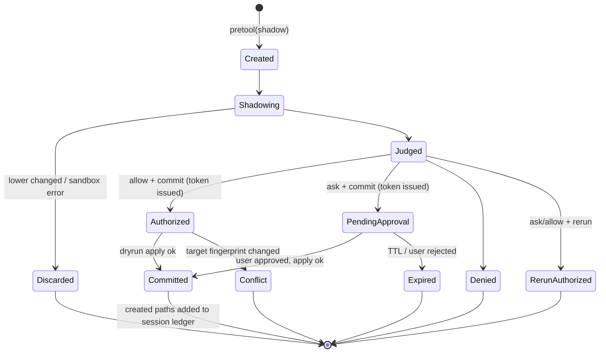

## 9. Commit engine

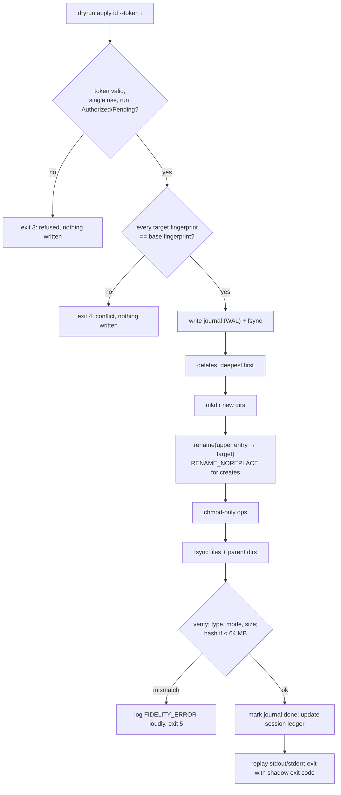

`dryrund` startup replays any journal that is not marked done. Every step is idempotent: re-running an
already-applied rename finds the target in its final state and skips it.

---

## 10. Security invariants (tested)

1. **The shadow does not affect the real system.** This covers the filesystem, sockets, network,
   processes, IPC, devices, kernel state, memory, process count, CPU/IO and disk. §7.1 lists each
   channel with its mechanism and canary (I1–I15). A failed canary disables shadowing, and every call
   then returns `ask`.
2. On the shadow path, a user command never runs outside the sandbox. Any setup failure means `ask`,
   not an unsandboxed run.
3. The only intended real effect is a commit of a reviewed ChangeSet, confined to the workspace and
   `/tmp` with no-symlink-follow path resolution. The commit never runs code.
4. Changes that would run code later (git hooks and config, `.claude/**`, `.envrc` …) always require
   `ask` (H9).
5. The agent cannot commit a run itself. An agent-typed `dryrun apply` is denied, and tokens are
   single-use and bound to a session and run.
5a. **Dry Run never runs repository-controlled code outside the sandbox.** Its own git queries
   (`status`, `ls-tree`, `merge-base`), which could trigger `core.fsmonitor` or clean filters from repo
   config, run inside a read-only bwrap sandbox with no network.
6. No telemetry. The decision log stays in the local state directory.
7. The adversarial corpus runs only inside disposable containers (sub-project 2), never on the
   development machine. The core's own tests use harmless targets inside temporary fixture
   directories.
8. The read-only fast path, which runs *without* a shadow, uses an **allowlist of commands and flags**,
   not a denylist. For example `sort -o`, `rg --pre`, `git -c`, `git diff --ext-diff`, `find`, `less`
   and any redirect or substitution are all excluded. Anything the allowlist doesn't cover goes to the
   shadow. Git reads are never on the native fast path: they run in the read-only sandbox and their
   output is replayed (`git_read`), because git config can make any "read" start a program.

## 11. Known limits (stated in the README)

- Linux and WSL2 only; workspaces must be on a local Linux filesystem (ext4, xfs or btrfs), not `/mnt/c`.
- Commands with effects that leave the machine cannot be shadowed. They fall back to text rules and
  `ask`, and their share of real-session commands is reported as the ceiling on the approach.
- Overlay semantics that cannot be committed faithfully (hard links, directory renames under EXDEV,
  special files) resolve to `ask + rerun`.
- In `rerun` mode the real run can differ from the shadow. A post-run divergence audit is planned for
  v1.1 (roadmap R2, §13).
- Defense in depth, not a guarantee. Keep backups and use OS sandboxing.

---

## 12. Research loop (built at the start of sub-project 2)

This section covers how Dry Run finds out which methods work. It borrows from karpathy/autoresearch:
a frozen evaluator, one editable surface per track, a fixed budget per run, a single metric, keep or
discard through git, and a simplicity criterion. It adds four things autoresearch lacks:
**method-level memory with abandonment**, **event-driven wake-ups** so monitoring is separate from
reasoning, **literature search only on demand**, and **a promotion gate** that validates before it
promotes. The rules are in [`research/program.md`](../research/program.md). The experiments are
six-line cards in [`research/cards/`](../research/cards/).

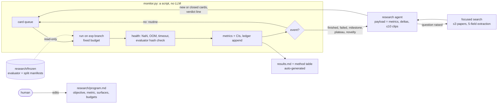

### 12.1 Method lifecycle: stop tuning a dead idea

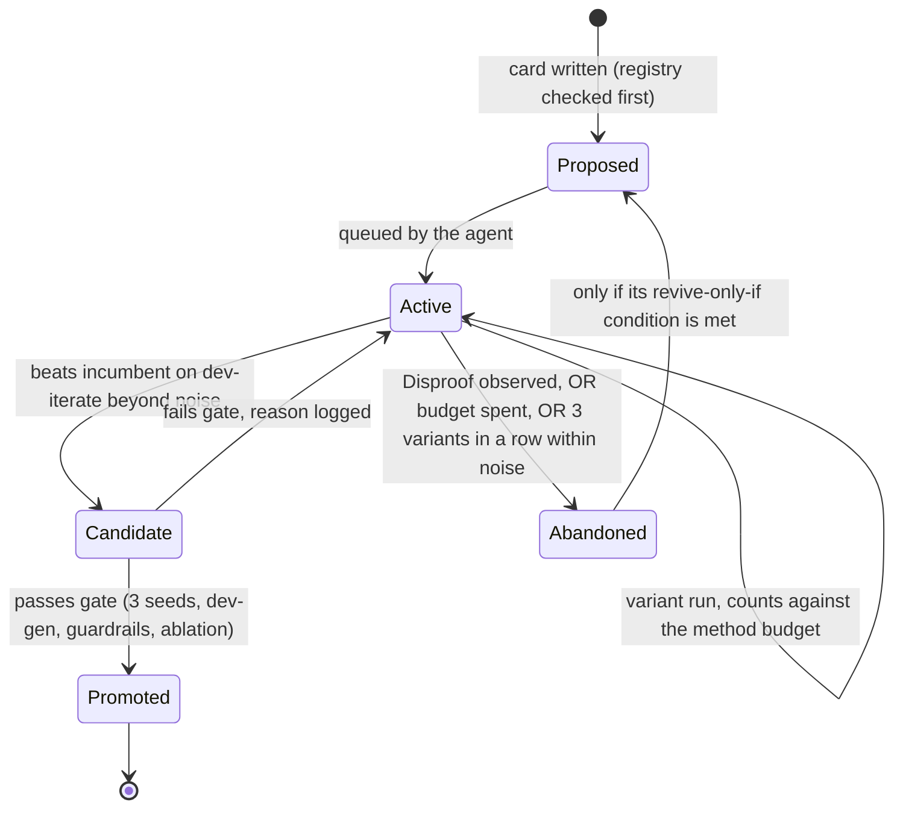

### 12.2 Evaluation splits: development vs final test

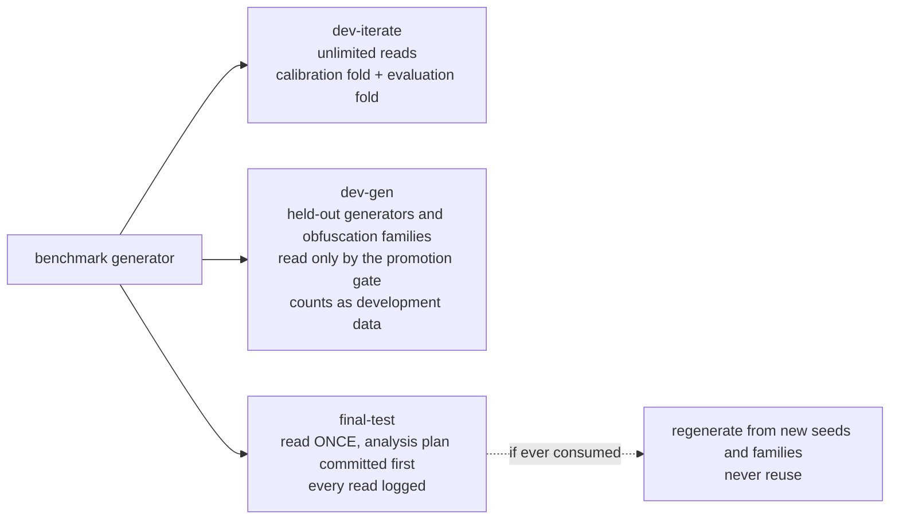

### 12.3 Decisions that follow from this

- **Judge objective ladder:** plain SFT + tuned threshold → cost-weighted CE → GRPO. With calibrated
  probabilities, the asymmetric cost of a miss is already handled at decision time by the threshold.
  So a higher rung must improve **ranking** (pAUC over benign-ask ∈ [0, 5%]) beyond noise, at each
  arm's own tuned threshold, to earn its place. Cost is measured, not assumed.
- **What counts as a card:** hypotheses about mechanisms (C-0001 onwards). Engineering features with a
  trigger metric belong in the roadmap (§13) and don't need cards.
- **Sub-project 1 uses the loop by hand:** cards plus a ledger for the sandbox-performance track
  (C-0001–C-0003). The monitor, the frozen evaluator and the automatic promotion gate are built at the
  start of sub-project 2, because they need the benchmark.
- **Dogfooding:** a Dry Run H9-style rule protects `research/frozen/**` from the agent that runs the
  experiments.

## 13. Roadmap (engineering features, each with a trigger)

| ID | Feature | Trigger metric (from the decision log or benchmark) | Target |
|---|---|---|---|
| R1 | Network-read tier: proxy that allows only registries and git hosts, plus cache pre-warming | H7 `ask + rerun` > 2% of shadowed commands in real sessions | v1.1 |
| R2 | Divergence audit for `rerun` mode: re-run in a fresh overlay and compare | `rerun` > 5% of decisions | v1.1 |
| R3 | Content-addressed shadow cache (argv, cwd, env, workspace fingerprint) | C-0003 shows fixed costs dominate, or repeat rate > 20% | v1.1 |
| R4 | Session-level effect accumulation for the judge | split-attack misses on the MT-AgentRisk-style benchmark class | SP3 |
| R5 | Taint from untrusted input (CaMeL/FIDES-style) | prompt-injection items in the benchmark missed | v2 |
| R6 | gVisor `runsc` backend for high-risk commands | an isolation canary fails on any supported kernel, or on user demand | v2 |
| R7 | Effect summary into auto mode through PostToolUse `classifierContext` | cheap; after v1 is stable | v1.1 |
| R8 | macOS port (APFS `clonefile` + `sandbox-exec`) | demand | v2 |
| R9 | Early Intervention Rate metric in the benchmark | SP2 spec | SP2 |
| R10 | Cost-aware shadowing (skip the shadow when the predicted cost is high and the risk is low) | real-session overhead > 1.5× after R3 | v2 |
